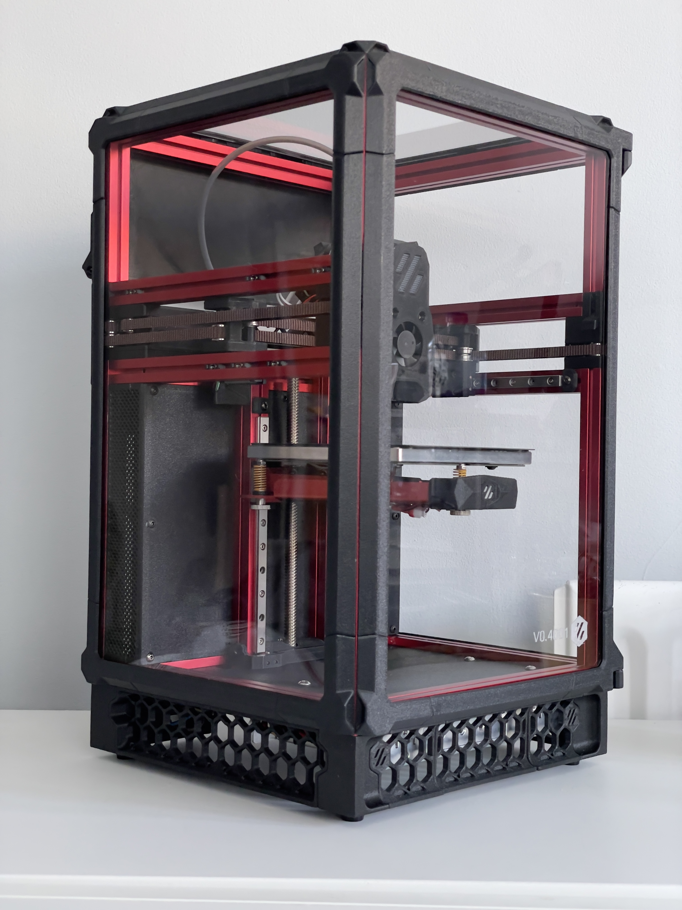
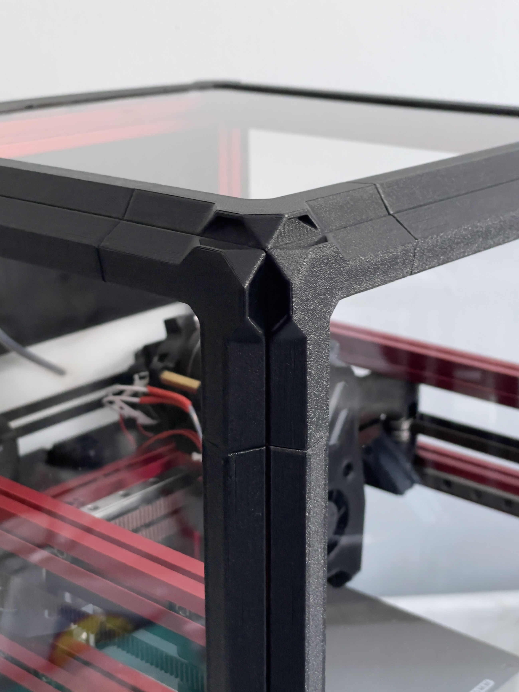
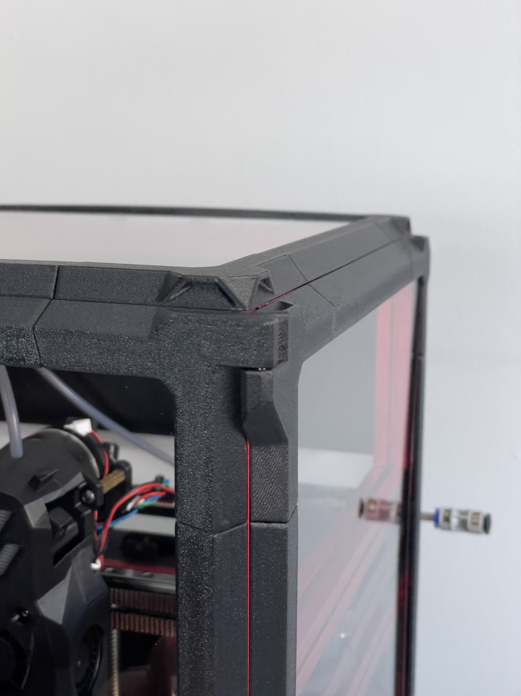
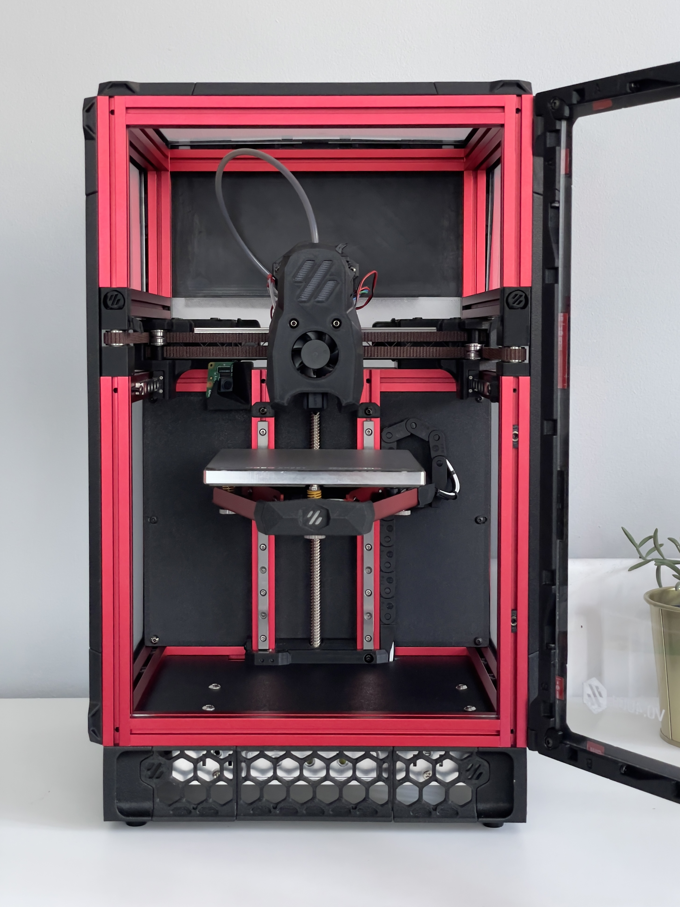
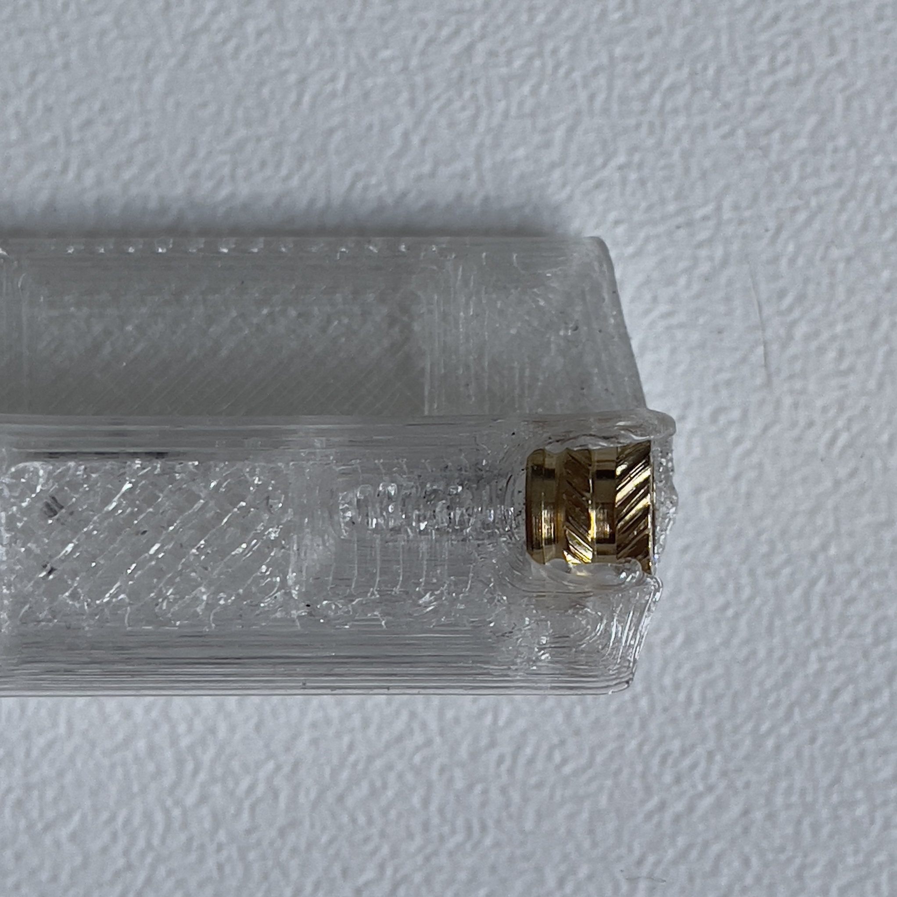
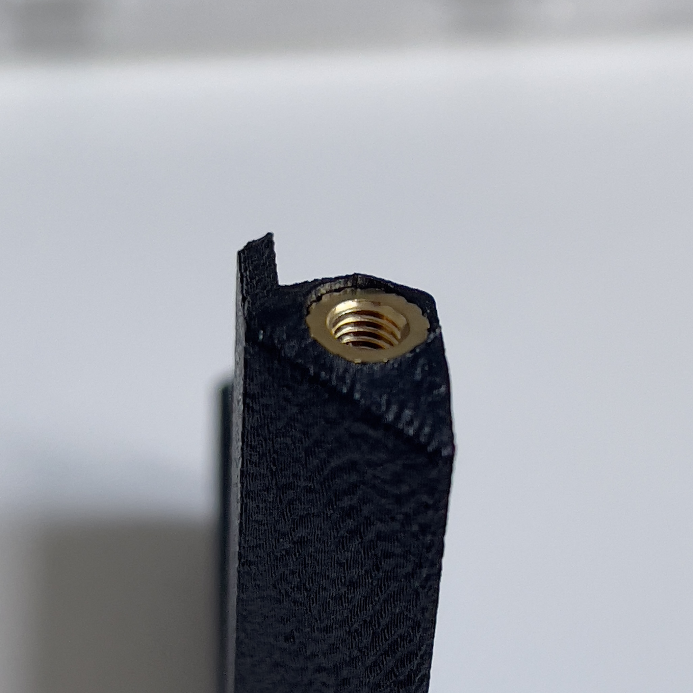
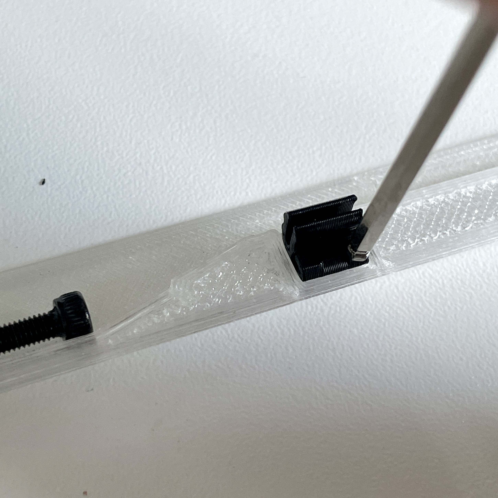
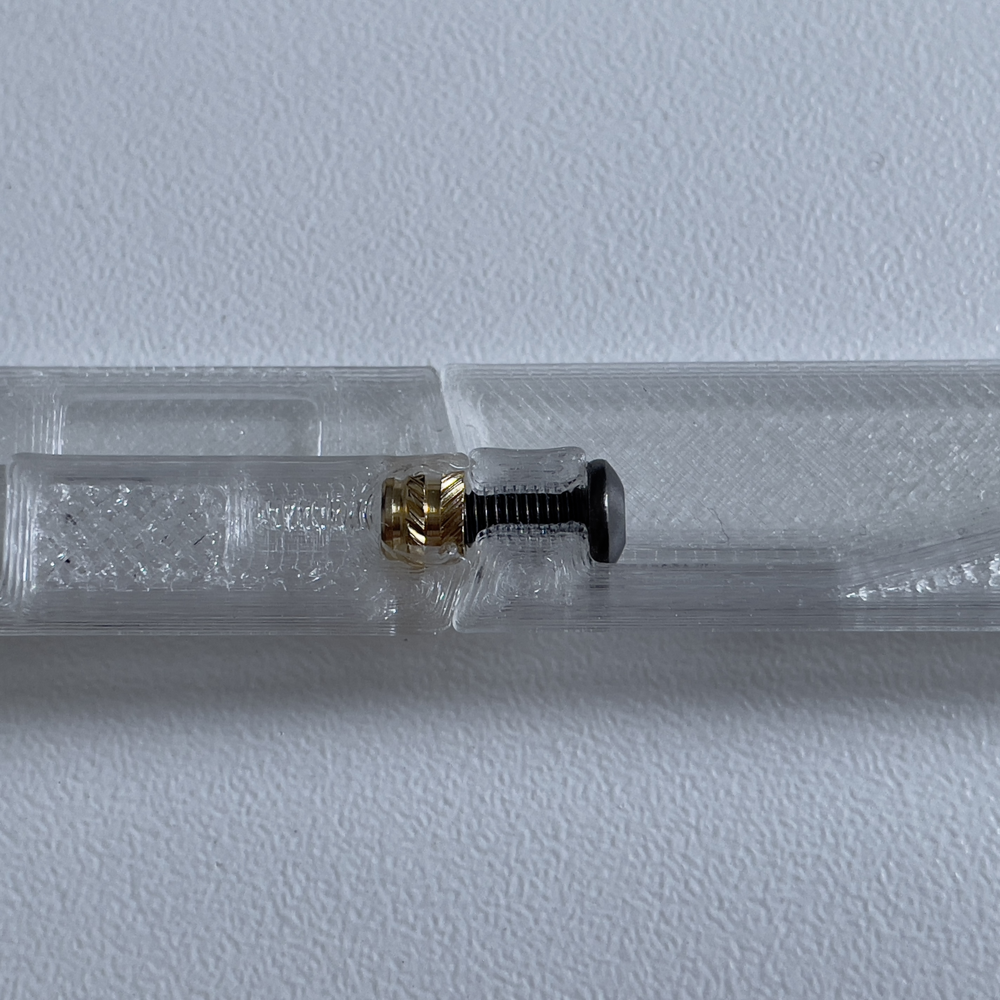
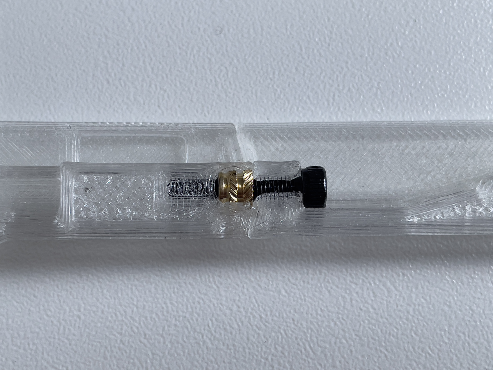

# Mini Monolith

## Intro

Mini Monolith is an adaptation of monolith panels from CloakedWayne with zeropanel clips from zruncho, adapted for 1515 extrusions and PFA’s.

I’ve seen a couple of really nice mini-monolith versions floating around, and have been waiting for release but needed something for my build so threw this together quickly.

This is currently only sized for 100mm tophat V0.2’s and any PFA variants like the Hex-Zero that has a 348mm vertical height. However, geometry is fairly easy to modify so cutting and extruding would allow different lengths for other PFA’s (please upload and share).

Unfortunately, I forgot that monolith doesn’t have a door closure system for a trident or V0 type hinged door so I’ve just been using 3 clips to keep the door closed. There are future plans to integrate colony clacker and mini fridge doors down the line. [If you like this project and want to help me get free filament, feel free to drop a like and download cad/stl’s from makerworld here](https://makerworld.com/en/models/1300382-mini-monolith-panels-for-voron-v0-v0-2-1515-pfa#profileId-1332588)

## Why Mini Monolith?

- Full panels sized panels help eliminate leakage through tophat panel gaps
- Compatibility with relaxed fit mini-fridge door panels (329mm x 209mm) for easy sourcing
- Similar panel stack to zero panels (6.8mm total squish height of 1mm VHB + 3mm panel +3mm foam)
- Mini monolith allows 2.8-3mm spacing between the frame and panels -allowing Pandora’s box and Hex-zero variants to have extra space for gantry
- Strong clamping force to enable thicker foam and more squish
- Extrusions covered to minimise heat loss
- Recessed VHB tape slots for 4mm panels + 3mm foam (if you have 3mm panels+3mm foam, attach the VHB to the non-recessed parts of the frame for adequate squish)

### Main changes:

- Heatset inserts instead of trapped nuts to connect sections
- Through bolted heatset screw reinforcement
- Hinges adapted for m3x20 pins commonly found in extruders or PTFE tubes like the original monolith
- Various dimensional changes

## BOM

- **Per side/panel**
    
    
    | Amount | Part | Notes  |
    | --- | --- | --- |
    | 12 | heatset inserts m3x5x4 (voron) | 3 per corner |
    | 8 | M3 x 16 BHSC/SHSC screws  | (10-16mm works) |
    | 1 roll | 1mm x 5mm VHB foam tape | Voron BOM VHB tape cut in half works |
    | 1 roll | 5-6mm wide, 3-5mm thick foam tape | 4.5m total for 3 panels + Top |
- **Hinges**
    
    
    | Part | Notes |
    | --- | --- |
    | 3x20mm pins | Common extruder pins |
    | 18mm PTFE tubes | 4mm OD |
- **Panels**
    
    1-3x Mini Fridge Door panels (relaxed fit 329mm x 209mm)
    
    1x 209x209mm top panel (nominal length of 210.8mm or 212x212mm using the experimental horizontals)
    
    | Qty. | Part | Notes |
    | --- | --- | --- |
    | 3 | Mini Fridge Door panels (3mm thick relaxed fit 329mm x 209mm) | Max dimensions: 329 x 210.8 |
    | 1 | 209x209mm top panel (3mm thick) | Max dimensions: 210.8 x 210.8 |
    | 0 | Experimental 212x212mm top panel (3mm thick) | Due to widening straights, the clips may be pushed towards the centreline and fall out of the printed frame easier |
- **Full coverage (2 Sides, Door and Top)**
    
    
    | Amount | Part | Notes  |
    | --- | --- | --- |
    | 48 | heatset inserts m3x5x4 (voron) | 3 per corner |
    | 32 | M3 x 16 BHSC/SHSC screws  | (10-16mm works) |
    | 1 roll | 1mm x 5mm VHB foam tape | Voron BOM VHB tape cut in half works |
    | 4.5M | 5-6mm wide, 3-5mm thick foam tape | 4.5m total for 3 panels + Top |
    | 2x | 3x20mm pins or 18mm PTFE tubes | 2 pins or 32mm ptfe total |
    | 3 | Mini Fridge Door panels (3mm thick relaxed fit 329mm x 209mm) | Max dimensions: 329 x 210.8 |
    | 1 | 209x209mm top panel (3mm thick) | Max dimensions: 210.8 x 210.8 |

## **Print notes:**

Like monolith, this is scaling/shrinkage sensitive with no compensation built in so tuned print profiles are strongly recommended. 

- Thin areas around screw access cutouts and corners are PA sensitive.
- Optional mouse ears on the longer sections are recommended for those that typically struggle with adhesion.
- If second layer perimeters are separating, turning off elephants foot compensation and dialing in first layers may help.
- The clips are the most sensitive part so make sure EM is perfect -if they are too loose, scaling them up slightly by 0.5-1% will help with hold.
- The model works best with 0.1mm increments but will still work fine at 0.2mm layer heights with no differences in testing. Initial layer height of 0.1 should work as well but is currently untested.
- Each panel will need 4 corners, either universal or hinged with 2 horizontals and 2 vertical straights. For 3 sided monolith and a tophat, you’d need to print:
    - 12x universal corners
    - 4x hinges
    - 6x vertical sections
    - 10x horizontal sections

*note: There is an experimental topside horizontal for stock 212x212mm panel size however, the extra width tilts the clips towards the centre. Frequent removal will likely result in loosening and clips being pulled out of the panels due to angle. Larger clip recommended.*

## **Assembly notes:**

Use the heatset tool to prevent bulging on the thin walls 

Ensure heatsets are fully inserted flush with the lowest edge

Press clips in firmly with something firm

Corner panel clips: ensure the screws are fully tight and lower than flush with the frame.

Optional:

If using screws longer than 10mm, prethread the plastic by screwing it into corner before attaching the straight. To prevent heatset pull out, maintain pressure while tapping the plastic past the insert. 16mm M3 screws will add a bit of rigidity and help with heatset pull out.

10mm minimum length

16mm Maximum length 

I’d like to give a big thanks to these people for their contribution that made this possible:

- CloakedWayne for his monolith design, concept, and amazingly neat/organised and easy to edit cad
- zruncho for his zeropanel clip geometry and research on panel stack
- #sonny5578, #chefha, and #brexited on Voron discord for teaching me cad and inputs
- Ukutghost #hamido. #simonsaysty - special thanks to you guys for wasting filament, beta testing tolerances, finding print issues and giving suggestions.
- #tigsteruk and Ukutghost- for being enthusiastic and helping me feel like my cad isn’t too janky to be shared
- #seti118- for getting panels to me so fast

License note:

Zruncho's ZeroPanels clip geometry retains its original licence that can be found [here](https://github.com/zruncho3d/ZeroPanels?tab=GPL-3.0-1-ov-file#readme).

