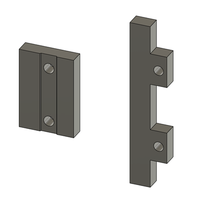

# TessaKavanagh ClickyClakyMod
##Acknowledgments
Special thanks for all  additions, goes to:
@luxflow

## Spacer

- If you want to use the original clickyclaky parts, print spacers from [STLs/Monolith_Panels_ClickyClackyMod v2.3mf](STLs/Monolith_Panels_ClickyClackyMod%20v2.3mf)
  - There are two types of spacers (see below) 
  - The left one is for handle hinges (print twice), and the right one is for handle latch (print once).

- If you don't want to use spacers, reprint the modded clickyclaky parts in [STLs/optional](STLs/optional/)

## Assembly

- To insert the door hinge side (mostly left side) monolith panels, you must detach door first.
