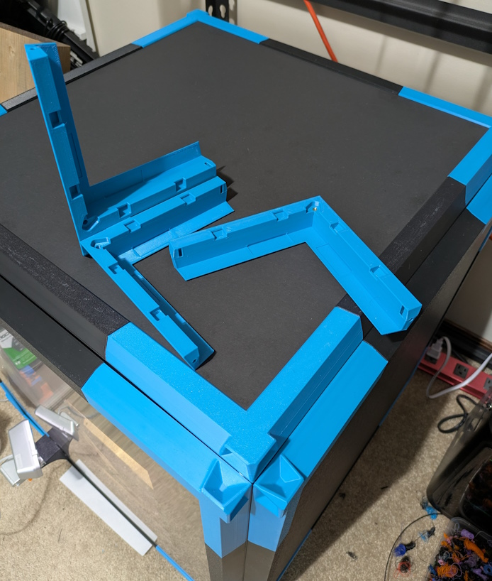

# Parametric Monolith Panels

I like Monolith Panels, but I wanted thicker panels to trap more heat. Design is not exactly the same as Wayne's original, more "inspired by".

# How to use
Upload the CAD file to fusion, open it, click "Modify" > "Change Parameters". Most parameters have a description or are self explanatory, but I am not good with words so YMMV.

Printing, BOM, and assembly should be pretty much the same as the originals, aside from the change in panel material.

